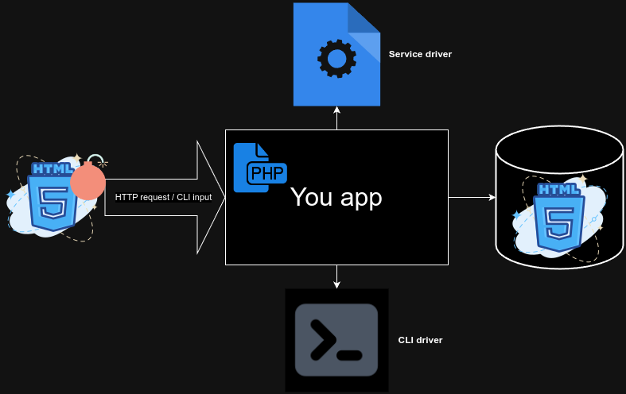

# Clean your strings from XSS threats

[](https://packagist.org/packages/medilies/xssless)
[](https://github.com/medilies/xssless/actions?query=workflow%3Arun-tests+branch%3Amain)
[](https://github.com/medilies/xssless/actions?query=workflow%3A"Fix+PHP+code+style+issues"+branch%3Amain)
[](https://packagist.org/packages/medilies/xssless)



Use what is recommended by [OWASP](https://cheatsheetseries.owasp.org/cheatsheets/Cross_Site_Scripting_Prevention_Cheat_Sheet.html#html-sanitization):

> HTML Sanitization will strip dangerous HTML from a variable and return a safe string of HTML. OWASP recommends DOMPurify for HTML Sanitization.

Note that the library is still in its alfa-phase. The methods exposed in this doc will most likely not change, but the configs and the internals may change a lot incase you decide to extend the package or create your own driver.

## Installation

Install the package via composer:

```bash
composer require medilies/xssless
```

For non Laravel projects pick a config and run the following code:

```php
$config = new Medilies\Xssless\Dompurify\DompurifyCliConfig('node', 'npm');

(new Medilies\Xssless\Xssless)
    ->using($config)
    ->setup();
```

### Laravel setup

You can publish the config file with:

```bash
php artisan vendor:publish --tag="xssless-config"
```

This is the contents of the published config file:

```php
return [
    'default' => 'dompurify-cli',

    'drivers' => [
        'dompurify-cli' => new DompurifyCliConfig(
            env('NODE_PATH', 'node'),
            env('NPM_PATH', 'npm'),
        ),
        'dompurify-service' => new DompurifyServiceConfig(
            env('NODE_PATH', 'node'),
            env('NPM_PATH', 'npm'),
            '127.0.0.1',
            63000,
        ),
    ],
];
```

Run the following command after picking your `xssless.default` config:

```shell
php artisan xssless:setup
```

## Usage

Using `Medilies\Xssless\Dompurify\DompurifyCliConfig`:

```php
$config = new Medilies\Xssless\Dompurify\DompurifyCliConfig('node', 'npm');

(new Medilies\Xssless\Xssless)
    ->using($config)
    ->clean($html);
```

Using `Medilies\Xssless\Dompurify\DompurifyServiceConfig`:

```php
$config = new Medilies\Xssless\Dompurify\DompurifyServiceConfig('node', 'npm', '127.0.0.1', 63000);

$xssless = (new Medilies\Xssless\Xssless)
    ->using($config);

/**
 * It is better to have this part in a separate script that runs continuously
 * and independently from your app that manages the HTTP requests or CLI input
 */
$xssless->start();

$xssless->clean($html);
```

### Laravel usage

Using `Medilies\Xssless\Dompurify\DompurifyCliConfig`:

```php
Medilies\Xssless\Laravel\Facades\Xssless::clean($html);
```

Using `Medilies\Xssless\Dompurify\DompurifyServiceConfig`:

```shell
php artisan xssless:start
```

```php
Medilies\Xssless\Laravel\Facades\Xssless::clean($html);
```

## Changelog

Please see [CHANGELOG](CHANGELOG.md) for more information on what has changed recently.

## Contributing

Please see [CONTRIBUTING](CONTRIBUTING.md) for details.

### Testing

```bash
./vendor/bin/pest
```

### Formatting

```bash
./vendor/bin/pint
```

## Security Vulnerabilities

Please review [our security policy](../../security/policy) on how to report security vulnerabilities.

## Credits

- [medilies](https://github.com/medilies)
- [All Contributors](../../contributors)

## License

The MIT License (MIT). Please see [License File](LICENSE.md) for more information.
